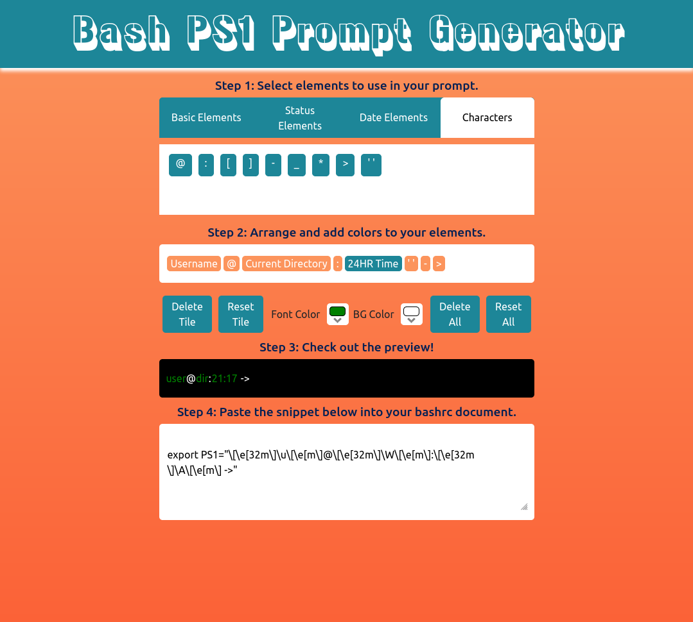

# React Bash PS1 Prompt Generator 

View the project live [here](https://brenton-j-andrews.github.io/react_ps1_generator/).

-----
#### About this project.

This project is a copy of [ezprompt.net](https://ezprompt.net/), which was used as a resource in a bash course that I have been taking. Design and git status / error status bash functions were sourced from the website, all functionality and logic was completed by me. 

-----

#### Frameworks

This project was built using React.

-----

#### Takeaways

This project gave me a little bit of experience using 'React-beautiful-dnd', a React library allows the use of drag-and-drop to manipulate arrays. I will definitely be using this library in future projects. 

